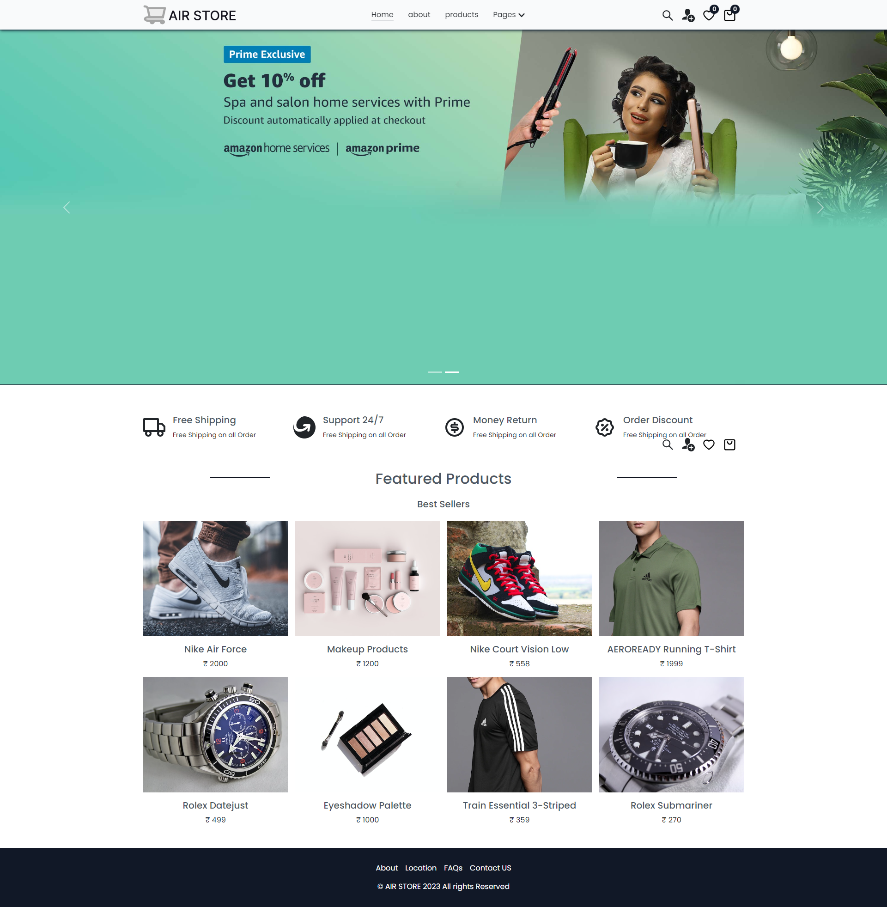

<br>


# Flash Sale - React E-Commerce Website

## About The Project

This is an e-commerce website built with `React`. It allows users to purchase goods online, manage their cart and wish list, and complete transactions. 

👉 [Live Demo](https://your-live-demo-link.com)

## Built With:

- React  
- Firebase (for backend services)  
- Styled Components (for styling)  
- [Any other technology you use]

<br/>

# Screenshot of the project 📸

<br/>
<h2 align="center">Home Page 🏡</h2>



## Installation

To set up the project locally, follow these steps:

```bash
  git clone https://github.com/Srivijai-S/FlashSale.git
  cd FlashSale
  npm install
  npm start

  npm run dev
```

## contribution

Pull requests are welcome, For Major changes, please open an issue first to discuss what you want to like to change
